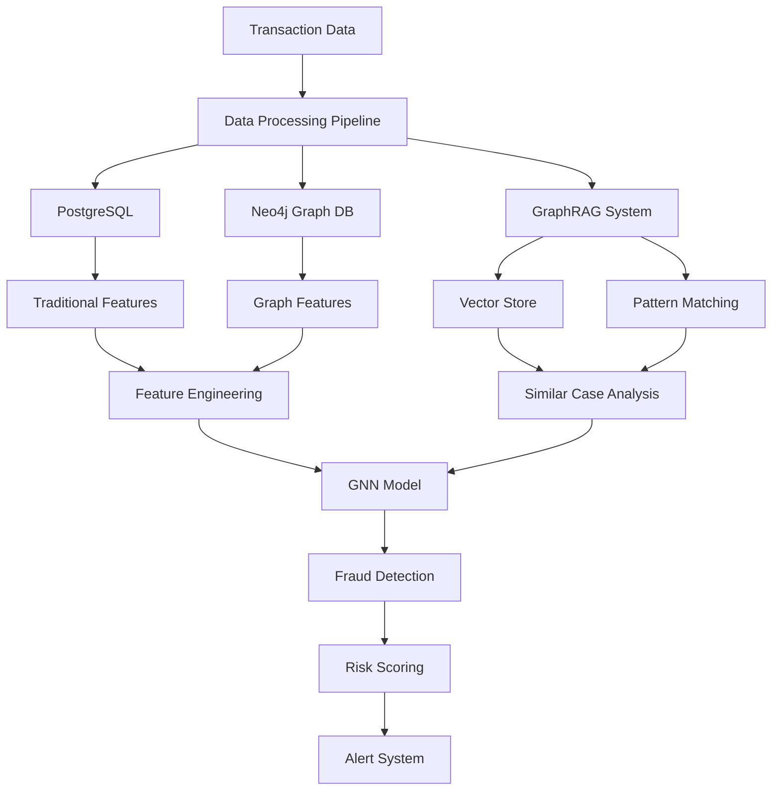
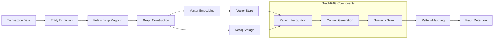
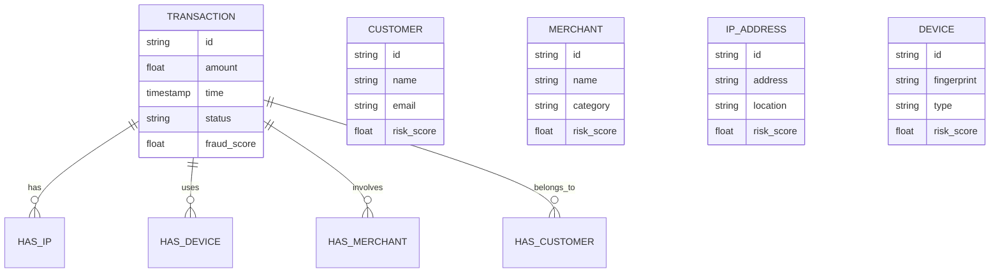
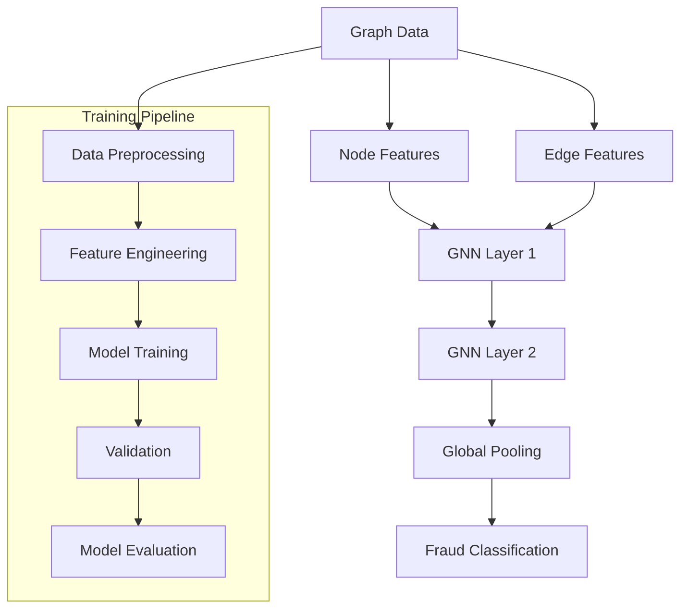
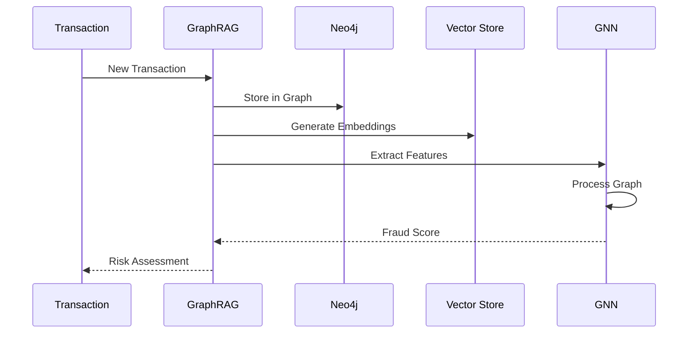
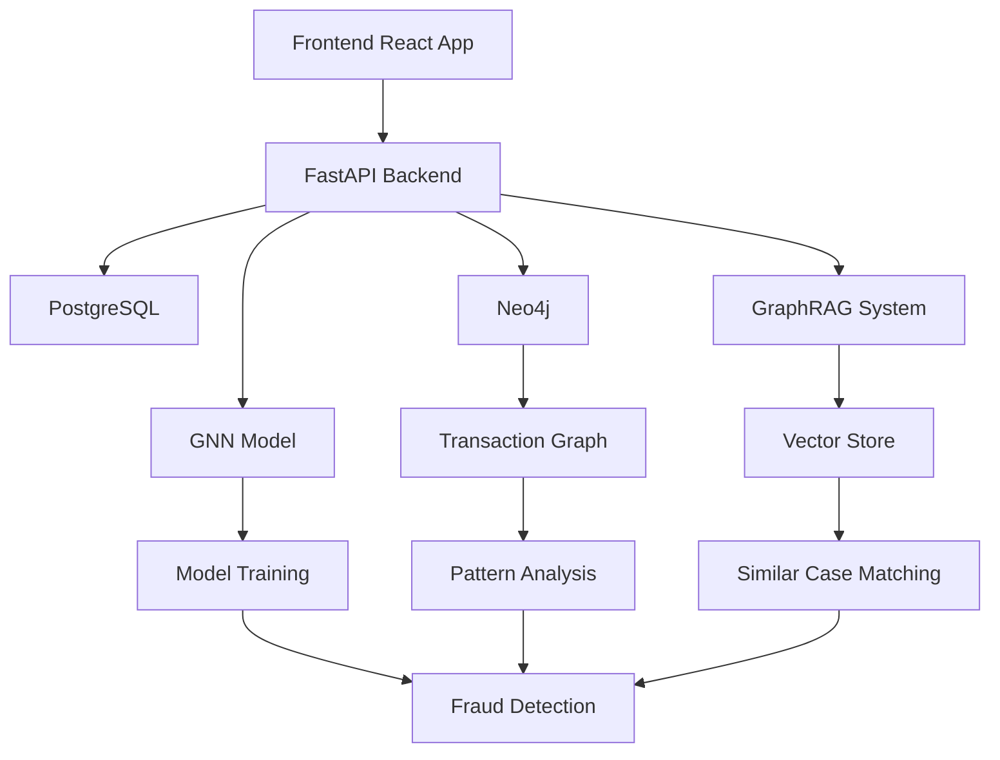
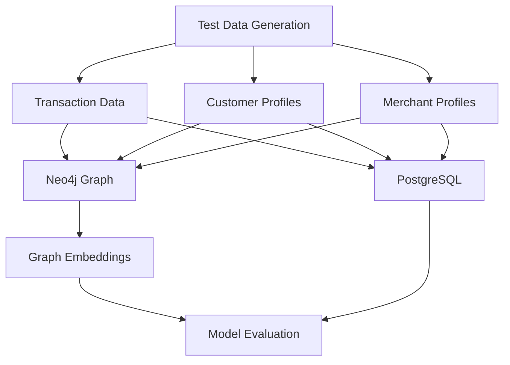
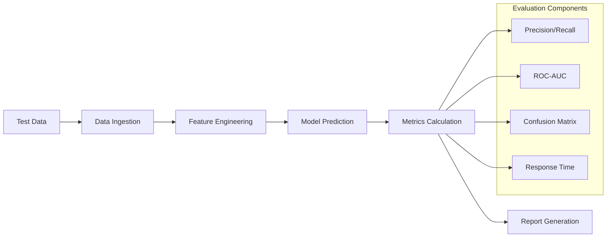

# Credit Fraud Detection System

A comprehensive credit fraud detection system using React.js, FastAPI, Neo4j, and GraphRAG for advanced fraud detection and analysis.

## Features

- Transaction data management
- Fraud detection using machine learning
- Graph-based fraud pattern analysis
- Real-time transaction monitoring
- Interactive visualization dashboard
- API documentation with Swagger UI

## System Design Documentation

### Architecture Overview



### Why GraphRAG for Fraud Detection?

GraphRAG (Graph-based Retrieval Augmented Generation) is particularly effective for fraud detection because:

1. **Enhanced Pattern Recognition**
   - Traditional ML: Limited to individual transaction features
   - GraphRAG: Captures complex relationships between transactions, customers, and merchants
   - Enables semantic understanding of fraud patterns

2. **Improved Accuracy Through:**
   - Graph-based feature extraction
   - Relationship-aware fraud detection
   - Pattern matching across historical data
   - Contextual understanding of transaction networks

3. **Real-time Analysis Capabilities**
   - Quick traversal of transaction networks
   - Immediate pattern matching
   - Dynamic fraud scoring

### Graph Database Construction with GraphRAG



#### Graph Schema Design



### GNN Training Process



#### GNN Architecture Details

1. **Input Layer**
   - Node features: Transaction amount, time, location
   - Edge features: Relationship type, strength
   - Graph structure: Transaction network

2. **GNN Layers**
   - Layer 1: Graph Convolution
     - Aggregates neighbor information
     - Updates node embeddings
   - Layer 2: Graph Attention
     - Learns importance of different relationships
     - Enhances fraud pattern detection

3. **Output Layer**
   - Global pooling for graph-level classification
   - Fraud probability prediction
   - Risk score calculation

### Data Flow and Processing



### System Components Interaction



## Local Development Setup

### Prerequisites

- Python 3.8+
- Node.js 16+
- Docker and Docker Compose
- Neo4j Desktop (optional, for local Neo4j development)
- PostgreSQL (optional, for local database development)

### Environment Setup

1. Clone the repository:
   ```bash
   git clone https://github.com/yourusername/credit-fraud-detection.git
   cd credit-fraud-detection
   ```

2. Create and configure environment files:
   ```bash
   # Backend
   cp backend/.env.example backend/.env
   # Frontend
   cp frontend/.env.example frontend/.env
   ```

3. Update the environment variables in both `.env` files with your configuration.

### Running Locally with Docker Compose

1. Start all services:
   ```bash
   docker-compose up --build
   ```

2. Access the services:
   - Frontend: http://localhost:3000
   - Backend API: http://localhost:8000
   - API Documentation: http://localhost:8000/docs
   - Neo4j Browser: http://localhost:7474

### Running Services Individually

#### Backend

1. Create and activate a virtual environment:
   ```bash
   python -m venv venv
   source venv/bin/activate  # On Windows: venv\Scripts\activate
   ```

2. Install dependencies:
   ```bash
   cd backend
   pip install -r requirements.txt
   ```

3. Run the FastAPI server:
   ```bash
   uvicorn main:app --reload --host 0.0.0.0 --port 8000
   ```

#### Frontend

1. Install dependencies:
   ```bash
   cd frontend
   npm install
   ```

2. Start the development server:
   ```bash
   npm start
   ```

### Local Testing

1. **Backend Testing**
   ```bash
   cd backend
   pytest
   ```

2. **Frontend Testing**
   ```bash
   cd frontend
   npm test
   ```

3. **Integration Testing**
   ```bash
   # Run the test suite
   python -m pytest tests/integration/
   ```

### Test Data Generation and Evaluation

1. **Generate Synthetic Test Data**
   ```bash
   # Generate synthetic transaction data
   python scripts/generate_test_data.py --num-transactions 10000 --fraud-ratio 0.05
   
   # Generate customer profiles
   python scripts/generate_customer_profiles.py --num-customers 1000
   
   # Generate merchant profiles
   python scripts/generate_merchant_profiles.py --num-merchants 500
   ```

2. **Data Ingestion Pipeline**
   ```bash
   # Ingest data into PostgreSQL
   python scripts/ingest_postgres.py --data-path ./test_data/transactions.csv
   
   # Ingest data into Neo4j
   python scripts/ingest_neo4j.py --data-path ./test_data/
   
   # Generate graph embeddings
   python scripts/generate_embeddings.py --batch-size 1000
   ```

3. **Evaluation Metrics**
   ```bash
   # Run evaluation pipeline
   python scripts/evaluate_model.py --test-set ./test_data/test_set.csv
   
   # Generate evaluation report
   python scripts/generate_report.py --output ./reports/evaluation_report.html
   ```

#### Test Data Structure



#### Evaluation Metrics

1. **Fraud Detection Metrics**
   - Precision
   - Recall
   - F1 Score
   - ROC-AUC
   - Confusion Matrix

2. **Graph Analysis Metrics**
   - Node Classification Accuracy
   - Link Prediction Performance
   - Graph Embedding Quality
   - Pattern Detection Rate

3. **System Performance Metrics**
   - Response Time
   - Throughput
   - Resource Utilization
   - Scalability

#### Test Data Generation Parameters

```python
# Example configuration for test data generation
test_config = {
    "num_transactions": 10000,
    "fraud_ratio": 0.05,
    "time_range": {
        "start": "2024-01-01",
        "end": "2024-03-31"
    },
    "amount_range": {
        "min": 10.0,
        "max": 10000.0
    },
    "customer_profiles": {
        "num_customers": 1000,
        "risk_levels": ["low", "medium", "high"]
    },
    "merchant_profiles": {
        "num_merchants": 500,
        "categories": ["retail", "food", "travel", "entertainment"]
    }
}
```

#### Evaluation Pipeline



#### Sample Evaluation Report

```json
{
    "model_performance": {
        "precision": 0.92,
        "recall": 0.88,
        "f1_score": 0.90,
        "roc_auc": 0.95
    },
    "graph_metrics": {
        "node_classification_accuracy": 0.89,
        "link_prediction_auc": 0.87,
        "pattern_detection_rate": 0.91
    },
    "system_metrics": {
        "avg_response_time": "150ms",
        "throughput": "1000 req/s",
        "cpu_utilization": "45%",
        "memory_utilization": "60%"
    }
}
```

## GCP Deployment

### Prerequisites

1. [Google Cloud SDK](https://cloud.google.com/sdk/docs/install) installed
2. [Terraform](https://www.terraform.io/downloads.html) installed (version >= 1.0)
3. A Google Cloud Project with billing enabled
4. Service account with necessary permissions

### Deployment Steps

1. **Configure GCP Project**
   ```bash
   # Set your project ID
   gcloud config set project YOUR_PROJECT_ID
   
   # Enable required APIs
   gcloud services enable \
     run.googleapis.com \
     sqladmin.googleapis.com \
     artifactregistry.googleapis.com \
     cloudbuild.googleapis.com
   ```

2. **Set Up Terraform**
   ```bash
   cd terraform
   
   # Initialize Terraform
   terraform init
   
   # Create terraform.tfvars
   cp terraform.tfvars.example terraform.tfvars
   ```

3. **Configure Variables**
   Edit `terraform.tfvars` with your values:
   ```hcl
   project_id = "your-project-id"
   region     = "us-central1"
   db_user    = "postgres"
   db_password = "your-secure-password"
   neo4j_password = "your-secure-password"
   openai_api_key = "your-openai-api-key"
   github_owner = "your-github-username"
   github_repo = "credit-fraud-detection"
   ```

4. **Deploy Infrastructure**
   ```bash
   # Review changes
   terraform plan
   
   # Apply configuration
   terraform apply
   ```

5. **Verify Deployment**
   ```bash
   # Get deployment outputs
   terraform output
   ```

### Deployment Architecture

- **Frontend**: Cloud Run service
- **Backend**: Cloud Run service
- **Databases**:
  - PostgreSQL: Cloud SQL
  - Neo4j: Compute Engine instance
- **CI/CD**: Cloud Build with GitHub integration
- **Container Registry**: Artifact Registry

## Troubleshooting Guide

### Common Issues and Solutions

1. **Database Connection Issues**
   - **Symptom**: Unable to connect to PostgreSQL or Neo4j
   - **Solution**:
     - Check database credentials in environment variables
     - Verify network connectivity and firewall rules
     - Ensure database services are running
     - Check database logs for errors

2. **API Connection Issues**
   - **Symptom**: Frontend cannot connect to backend API
   - **Solution**:
     - Verify API URL in frontend environment variables
     - Check CORS configuration in backend
     - Ensure both services are running
     - Check network connectivity

3. **Docker Issues**
   - **Symptom**: Container fails to start or build
   - **Solution**:
     - Check Docker logs: `docker logs <container_id>`
     - Verify Dockerfile syntax
     - Ensure all required files are present
     - Check port conflicts

4. **Cloud Run Deployment Issues**
   - **Symptom**: Service fails to deploy or start
   - **Solution**:
     - Check Cloud Build logs
     - Verify container image exists in Artifact Registry
     - Check service account permissions
     - Review environment variables

5. **Neo4j Performance Issues**
   - **Symptom**: Slow queries or high memory usage
   - **Solution**:
     - Adjust Neo4j memory settings
     - Check query optimization
     - Monitor instance resources
     - Consider scaling up instance size

### Logging and Monitoring

1. **Local Development**
   ```bash
   # Backend logs
   docker-compose logs backend
   
   # Frontend logs
   docker-compose logs frontend
   
   # Database logs
   docker-compose logs postgres
   docker-compose logs neo4j
   ```

2. **GCP Deployment**
   ```bash
   # View Cloud Run logs
   gcloud logging read "resource.type=cloud_run_revision" --limit 50
   
   # View Cloud SQL logs
   gcloud logging read "resource.type=cloudsql_database" --limit 50
   
   # View Cloud Build logs
   gcloud builds log
   ```

### Performance Optimization

1. **Database Optimization**
   - Create appropriate indexes
   - Optimize query patterns
   - Monitor connection pools
   - Regular maintenance

2. **Application Optimization**
   - Enable caching where appropriate
   - Optimize API endpoints
   - Implement rate limiting
   - Use connection pooling

3. **Infrastructure Optimization**
   - Right-size resources
   - Enable auto-scaling
   - Implement CDN for static assets
   - Use appropriate instance types

## Contributing

1. Fork the repository
2. Create a feature branch
3. Commit your changes
4. Push to the branch
5. Create a Pull Request

## License

This project is licensed under the MIT License - see the [LICENSE](LICENSE) file for details.

### License Summary

The MIT License is a permissive license that is short and to the point. It lets people do anything they want with the code as long as they provide attribution back to you and don't hold you liable.

#### What you can do with this code:

- ✅ Use the code commercially
- ✅ Modify the code
- ✅ Distribute the code
- ✅ Use the code privately
- ✅ Sublicense the code

#### What you must do:

- ✅ Include the original copyright notice
- ✅ Include the license text

#### What you cannot do:

- ❌ Hold the authors liable
- ❌ Use the authors' names/trademarks without permission

### Third-Party Licenses

This project uses several third-party libraries and tools. Their respective licenses are listed below:

1. **Frontend Dependencies**
   - React.js - MIT License
   - Material-UI - MIT License
   - D3.js - BSD 3-Clause License
   - Axios - MIT License

2. **Backend Dependencies**
   - FastAPI - MIT License
   - Neo4j Python Driver - Apache License 2.0
   - SQLAlchemy - MIT License
   - Pydantic - MIT License
   - PyTorch - BSD 3-Clause License

3. **Development Tools**
   - Docker - Apache License 2.0
   - Terraform - Mozilla Public License 2.0
   - GitHub Actions - MIT License

For detailed license information of each dependency, please refer to their respective package files or documentation.

### Contributing

By contributing to this project, you agree that your contributions will be licensed under the same MIT License as the project. This ensures that the project remains open source and freely available to everyone. 